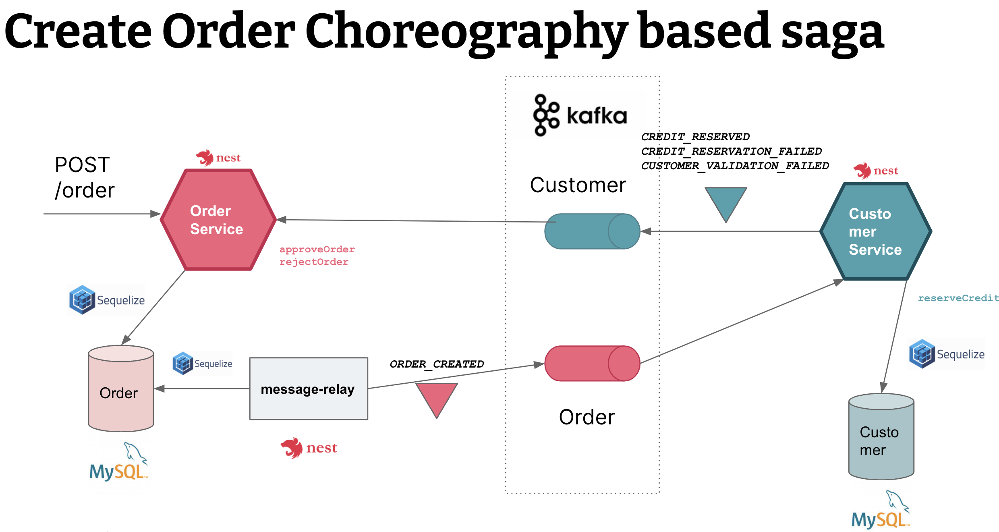

# Message Relay Service

The `Message Relay Service` implements the [Transactional outbox](https://microservices.io/patterns/data/transactional-outbox.html) pattern.
The service periodically poll the `Outboxses` table in MySQL database for Orders (used by the `Order Service`), 
and then it publishes `Order`
domain events that are consumed by the `Customer Service`.

